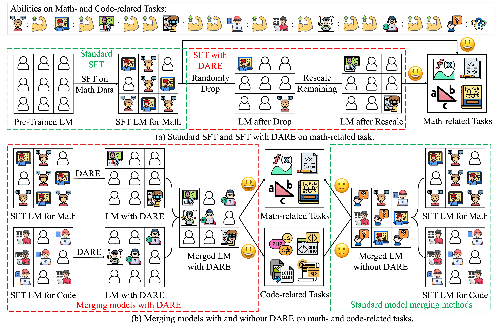
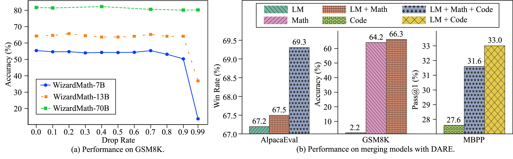

# Language Models are Super Mario: Absorbing Abilities from Homologous Models as a Free Lunch

<div  align="center">  
 
</div>

This repository is built for the paper [Language Models are Super Mario: Absorbing Abilities from Homologous Models as a Free Lunch](https://arxiv.org/abs/2311.03099).
🔔 If you have any questions or suggestions, please feel free to let us know. 
You can directly email [Le Yu](https://yule-buaa.github.io/) using the email address yule@buaa.edu.cn or post an issue on this repository.

## Overview

In this work, we uncover that Language Models (LMs), either encoder- or decoder-based, can **obtain new capabilities by assimilating the parameters of homologous models without the need for retraining or GPUs**. 
1. We introduce a novel operation called **DARE** to directly set most of (90% or even 99%) the delta parameters to zeros without affecting the capabilities of SFT LMs. 
2. We sparsify delta parameters of multiple SFT homologous models with DARE as a **general preprocessing technique** and subsequently merge them into a single model by parameter averaging.

The workflow is shown as follows,
<div  align="center">  
 
</div>

By conducting extensive experiments, we find that: 
1. DARE is effective for SFT models whose delta parameter value ranges are relatively small (e.g., within 0.005), being able to eliminate even 99\% delta parameters. Larger models can tolerate a higher proportion of discarded parameters, indicating that SFT naturally learns an extremely sparse set of delta parameters, and nearly all abilities originate from the pre-trained LMs. See (a) in the figure below. 
2. DARE can merge multiple task-specific LMs into one LM with diverse abilities, which is able to possess the functionalities of all SFT models. For instance, the merger of WizardLM and WizardMath increases the GSM8K accuracy of WizardLM from 2.2 to 66.3, maintaining its instruction-following capabilities while surpassing WizardMath's original 64.2 performance. See (b) in the figure below.
<div  align="center">  
 
</div>


## Language Models and Datasets 

We conduct experiments on both encoder- and decoder-based LMs.
* For encoder-based LMs, we choose bert-base-uncased and roberta-base as pre-trained backbones. Eight datasets from the GLUE benchmark are used, including CoLA, SST-2, MRPC, STS-B, QQP, MNLI, QNLI, and RTE.
* For decoder-based LMs, we choose WizardLM, WizardMath, WizardCoder-Python, and Code Alpaca as pre-trained backbones. 
We evaluate three tasks on five datasets: AlpacaEval (instruction-following), GSM8K and MATH (mathematical reasoning), and HumanEval and MBPP (code-generating).

Note that we provide GSM8K, MATH, and MBPP datasets in ```math_code_data/``` folder, which are obtained from [WizardLM repository](https://github.com/nlpxucan/WizardLM). 
Other datasets can be automatically downloaded by our codes. For language models, you can download them either manually or by our codes.   

You can also modify the ```cache_dir``` in the ```utils/load_config.py``` file to specify your own path to save datasets and models.

## Model Merging Methods

We provide a well-coded implementation of five model merging methods in this repository, including 
[Average Merging](https://arxiv.org/abs/2203.05482), 
[Task Arithmetic](https://arxiv.org/abs/2212.04089), 
[Fisher Merging](https://arxiv.org/abs/2111.09832), 
[RegMean](https://arxiv.org/abs/2212.09849), and 
[TIES-Merging](https://arxiv.org/abs/2306.01708). 
We also combine the proposed [DARE](https://arxiv.org/abs/2311.03099) with the above methods to facilitate the merging performance.


## Environments

[PyTorch 2.0.1](https://pytorch.org/),
[transformers 4.33.1](https://huggingface.co/docs/transformers/index),
[datasets 2.13.1](https://huggingface.co/docs/datasets/index),
[vllm 0.11.4](https://github.com/vllm-project/vllm),
[human_eval](https://github.com/openai/human-eval),
[numpy](https://github.com/numpy/numpy), and
[tqdm](https://github.com/tqdm/tqdm).


## Executing Scripts for Encoder-based LMs
For encoder-based LMs, we first fine-tune them on the GLUE benchmark (support both single-task and multi-tasl settings), 
and then inference with them. We also provide scripts to merge encoder-based LMs with five model merging methods. 

### Scripts for Fine-Tuning on GLUE
* Example of fine-tuning *roberta-base* on *CoLA* dataset under single-task setting:
```{bash}
python train_plms_glue.py --language_model_name roberta-base --dataset_name cola --learning_rate 1e-5 --num_runs 5
```
* Example of fine-tuning *roberta-base* on *CoLA* and *RTE* datasets under multi-task setting:
```{bash}
python train_plms_glue.py --language_model_name roberta-base --dataset_name cola --multitask_training --auxiliary_dataset_name rte --learning_rate 1e-5 --num_runs 5
```

### Scripts for Inference with DARE and Other Variants
* Example of direct inference on *roberta-base* (drop rate 0.0):
```{bash}
python inference_plms_glue.py --language_model_name roberta-base --weight_mask_rate 0.0
```
* Example of inference on *roberta-base* with DARE (drop rate 0.9):
```{bash}
python inference_plms_glue.py --language_model_name roberta-base --weight_mask_rate 0.9 --use_weight_rescale
```
* Example of inference on *roberta-base* with DropOnly (drop rate 0.9):
```{bash}
python inference_plms_glue.py --language_model_name roberta-base --weight_mask_rate 0.9
```
* Example of inference on *roberta-base* with magnitude-based pruning (drop rate 0.9):
```{bash}
python inference_plms_glue.py --language_model_name roberta-base --weight_mask_rate 0.9 --mask_strategy magnitude
```
* Example of inference on *roberta-base* with masking fine-tuned parameters (drop rate 0.9):
```{bash}
python inference_plms_glue.py --language_model_name roberta-base --weight_mask_rate 0.9 --use_weight_rescale --weight_format finetuned_weight
```

### Scripts for Merging Models
* Example of merging pairwise fine-tuned *roberta-base* with Average Merging:
```{bash}
python merge_plms_glue.py --merging_method_name average_merging --language_model_name roberta-base
```
* Example of merging pairwise fine-tuned *roberta-base* with Fisher Merging:
```{bash}
python merge_plms_glue.py --merging_method_name fisher_merging --normalize_fisher_weight --language_model_name roberta-base
```
* Example of merging pairwise fine-tuned *roberta-base* with Average Merging and DARE:
```{bash}
python merge_plms_glue.py --merging_method_name mask_merging --use_weight_rescale --language_model_name roberta-base --mask_apply_method average_merging
```


## Executing Scripts for Decoder-based LMs
Since the decoder-based LMs we use have already been fine-tuned, they can be directly utilized for inference.
We also provide scripts to merge decoder-based LMs with two model merging methods (Average Merging and Task Arithmetic).

### Scripts for Inference with DARE and Other Variants
* Example of direct inference on *WizardMath-7B-V1.0* on *GSM8K* (drop rate 0.0):
```{bash}
python inference_llms_instruct_math_code.py --dataset_name gsm8k --finetuned_model_name WizardMath-7B-V1.0 --tensor_parallel_size 1 --weight_mask_rate 0.0
```
* Example of inference on *WizardMath-7B-V1.0* on *GSM8K* with DARE (drop rate 0.9):
```{bash}
python inference_llms_instruct_math_code.py --dataset_name gsm8k --finetuned_model_name WizardMath-7B-V1.0 --tensor_parallel_size 1 --weight_mask_rate 0.9 --use_weight_rescale
```
* Example of inference on *WizardMath-7B-V1.0* on *GSM8K* with DropOnly (drop rate 0.9):
```{bash}
python inference_llms_instruct_math_code.py --dataset_name gsm8k --finetuned_model_name WizardMath-7B-V1.0 --tensor_parallel_size 1 --weight_mask_rate 0.9
```
* Example of inference on *WizardMath-7B-V1.0* on *GSM8K* with magnitude-based pruning (drop rate 0.9):
```{bash}
python inference_llms_instruct_math_code.py --dataset_name gsm8k --finetuned_model_name WizardMath-7B-V1.0 --tensor_parallel_size 1 --weight_mask_rate 0.9 --mask_strategy magnitude
```
* Example of inference on *WizardMath-7B-V1.0* on *GSM8K* with masking fine-tuned parameters (drop rate 0.9):
```{bash}
python inference_llms_instruct_math_code.py --dataset_name gsm8k --finetuned_model_name WizardMath-7B-V1.0 --tensor_parallel_size 1 --weight_mask_rate 0.9 --use_weight_rescale --weight_format finetuned_weight
```

### Scripts for Merging Models
* Example of merging *WizardLM-13B-V1.2* and *WizardMath-13B-V1.0* with Average Merging:
```{bash}
python merge_llms_instruct_math_code.py --merge_instruct --merge_math --merging_method_name average_merging --tensor_parallel_size 1
```
* Example of merging *WizardLM-13B-V1.2* and *WizardMath-13B-V1.0* with Task Arithmetic:
```{bash}
python merge_llms_instruct_math_code.py --merge_instruct --merge_math --merging_method_name task_arithmetic --scaling_coefficient 1.0 --tensor_parallel_size 1
```
* Example of merging *WizardLM-13B-V1.2* and *WizardMath-13B-V1.0* with Average Merging and DARE (drop rate 0.2):
```{bash}
python merge_llms_instruct_math_code.py --merge_instruct --merge_math --merging_method_name mask_merging --use_weight_rescale --weight_mask_rate 0.2 --mask_apply_method average_merging --tensor_parallel_size 1
```

❗**Note 1**: When merging decoder-based LMs, the number of GPUs we should allocate is equals to num_models_to_merge * tensor_parallel_size.
For example, if we want to merge *WizardLM-13B-V1.2* and *WizardMath-13B-V1.0* with tensor_parallel_size == 1, then we should allocate 2 * 1 = 2 GPUs.

❗**Note 2**: If "AssertionError: data parallel group is already initialized" error is raised by vllm on your device, please try to run ```direct_inference_merged_llms_instruct_math_code.py``` with the corresponding setting.
For example, if this error occurs when merging *WizardLM-13B-V1.2* and *WizardMath-13B-V1.0* with Average Merging and DARE (drop rate 0.2), please run the following command to evaluate on instruct- or math-related task
```{bash}
python direct_inference_merged_llms_instruct_math_code.py --merge_instruct --merge_math --merging_method_name mask_merging --use_weight_rescale --weight_mask_rate 0.2 --mask_apply_method average_merging --tensor_parallel_size 1 --evaluate_task instruct
python direct_inference_merged_llms_instruct_math_code.py --merge_instruct --merge_math --merging_method_name mask_merging --use_weight_rescale --weight_mask_rate 0.2 --mask_apply_method average_merging --tensor_parallel_size 1 --evaluate_task math
```

### Evaluation Process for AlpacaEval, HumanEval and MBPP
For AlpacaEval, HumanEval and MBPP, our codes will store the generated files and please additionally run the following evaluation commands to get the final metrics.

* For AlpacaEval:
We use ```chatgpt_fn``` in [alpaca_eval repository](https://github.com/tatsu-lab/alpaca_eval) to compute the win rate. Firstly, please see [alpaca_eval repository](https://github.com/tatsu-lab/alpaca_eval) to install the environment.
Then, if you want to evaluate the generated *WizardLM-13B-V1.2_inference_mask_0.2_rescale_True.json* file, please run
```{bash}
alpaca_eval --model_outputs ./save_gen_instruct_responses_results/alpaca_eval/WizardLM-13B-V1.2_inference_mask_0.2_rescale_True.json --annotators_config chatgpt_fn --name WizardLM-13B-V1.2_inference_mask_0.2_rescale_True
```

* For HumanEval:
Firstly, please see [human-eval repository](https://github.com/openai/human-eval) to install the environment.
Then, if you want to evaluate the generated *WizardCoder-Python-13B-V1.0_inference_mask_0.2_rescale_True.jsonl* file, please run
```{bash}
evaluate_functional_correctness ./save_gen_codes_results/human_eval/WizardCoder-Python-13B-V1.0_inference_mask_0.2_rescale_True.jsonl
```

* For MBPP:
Firstly, please see [bigcode-evaluation-harness repository](https://github.com/bigcode-project/bigcode-evaluation-harness) to install the environment.
Then, if you want to evaluate the generated *WizardCoder-Python-13B-V1.0_inference_mask_0.2_rescale_True.jsonl* file, please run
```{bash}
accelerate launch ./bigcode-evaluation-harness/main.py --tasks mbpp --allow_code_execution --load_generations_path ./save_gen_codes_results/mbpp/WizardCoder-Python-13B-V1.0_inference_mask_0.2_rescale_True.jsonl
```

## Acknowledgments

We are grateful to the authors of [WizardLM](https://github.com/nlpxucan/WizardLM) for making their project codes publicly available.


## Citation

Please consider citing our paper when using this project.
```{bibtex}
@article{yu2023language,
  title={Language Models are Super Mario: Absorbing Abilities from Homologous Models as a Free Lunch},
  author={Yu, Le and Yu, Bowen and Yu, Haiyang and Huang, Fei and Li, Yongbin},
  journal={arXiv preprint arXiv:2311.03099},
  year={2023}
}
```
